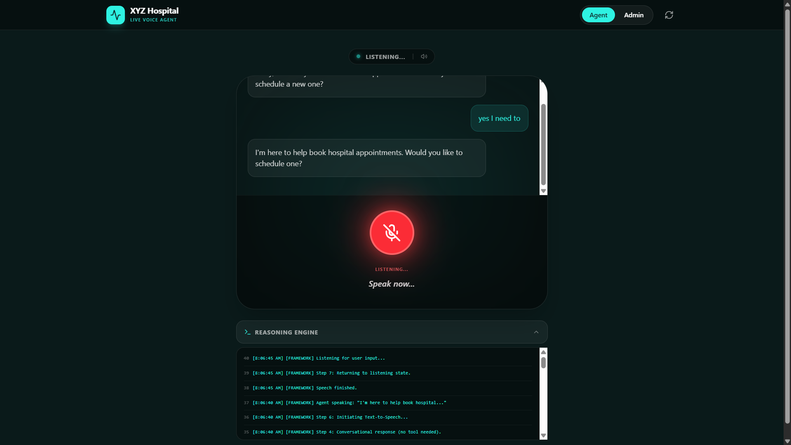
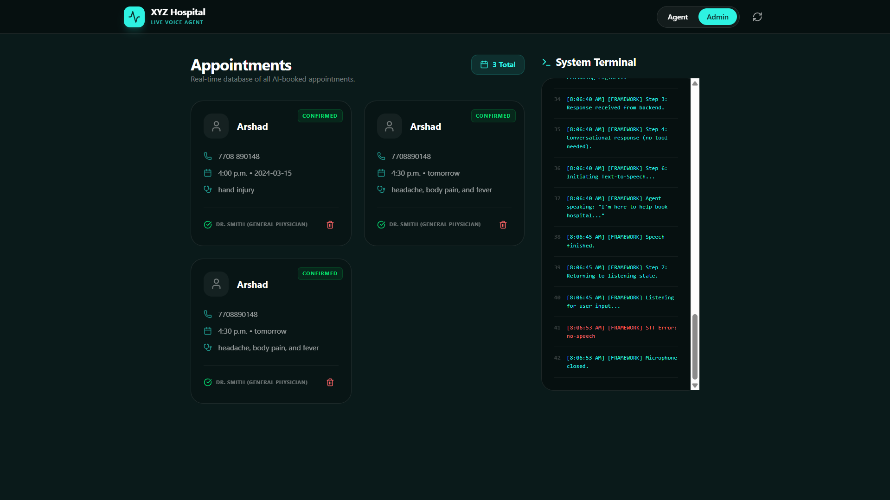
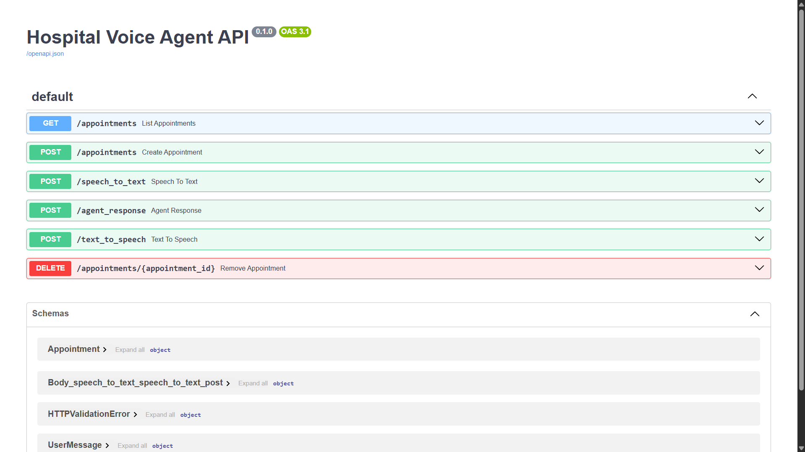

# AI Voice Agent


---

## Overview

AI Voice Agent is a conversational AI system designed to simulate a hospital receptionist.  
Users can interact using voice or text to schedule doctor appointments through a natural conversation.

The system collects patient details step-by-step, confirms the appointment, and stores the booking in a backend database. An admin dashboard allows real-time viewing and management of appointments.

---

## Application Screenshots

| Conversation Interface | Admin Dashboard |
|---|---|
|  |  |

---

### FastAPI Backend



---

## Tech Stack

| Component | Technology |
| :--- | :--- |
| Frontend |  |
| Backend |  |
| Language |  |
| Database |  |
| LLM Provider |  |
| Speech-to-Text | Whisper |
| Text-to-Speech | Edge TTS |

---

## Features

### Conversational Appointment Booking
The AI agent collects appointment details in a natural dialogue format.

### Voice Interaction
Speech input is converted to text and processed by the AI agent.

### Real-Time Appointment Dashboard
Appointments are stored and displayed instantly in the admin interface.

### Intelligent Slot Confirmation
The agent verifies appointment availability before booking.

### Appointment Updates
If a user provides an existing phone number, the system updates the appointment instead of creating duplicates.

### Admin Panel
Administrators can view and manage confirmed appointments.

---

## System Architecture

```bash
User Voice / Text
      │
      ▼
Frontend (React)
      │
      ▼
FastAPI Backend
      │
      ▼
Groq LLM Reasoning
      │     
      ▼
Appointment Processing
      │
      ▼
SQLite Database
      │
      ▼
Admin Dashboard
```

---

## Project Structure

```bash
Hospital-Voice-Agent
│
├── backend
│ ├── agent
│ │ ├── llm_engine.py
│ │ └── workflow.py
│ │
│ ├── voice
│ │ └── engines.py
│ │
│ ├── tools
│ │ └── appointment_tools.py
│ │
│ └── main.py
│
├── src
│ ├── App.tsx
│ └── main.tsx
│
├── hospital.db
├── requirements.txt
├── package.json
├── server.ts
└── README.md
```

---

## Installation

### Clone Repository

git clone https://github.com/yourusername/ai-voice-agent.git

```bash
cd ai-voice-agent
```

---

### Create Python Environment

```bash
python -m venv venv
```

### Activate environment

```bash
Windows - venv\Scripts\activate
Mac/Linux - source venv\Scripts\activate
```

---

### Install Backend Dependencies

```bash
pip install -r requirements.txt
```

---

### Install Frontend Dependencies

```bash
npm install
```

---

## Environment Variables

Create `.env` file in root:

```bash
GROQ_API_KEY=your_api_key_here
```


---

## Running the Application

### Start Backend

```bash
uvicorn backend.main:app --reload --port 3000
```

Backend Runs at

```bash
http://localhost:3000
http://localhost:3000/docs
```

---

### Start Frontend

```bash
npm run dev
opens at http://localhost:5173
```

## Author

Arshath Farwyz | AI/ML Engineer

## Requirements

```
pip install -r requirements.txt
```


---
**Last updated:** 2026-07-19
